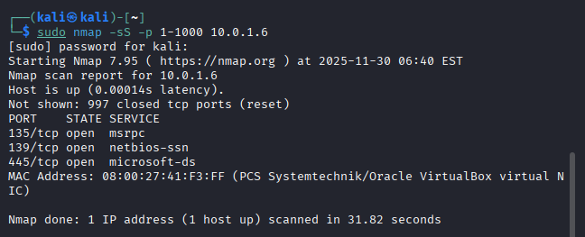
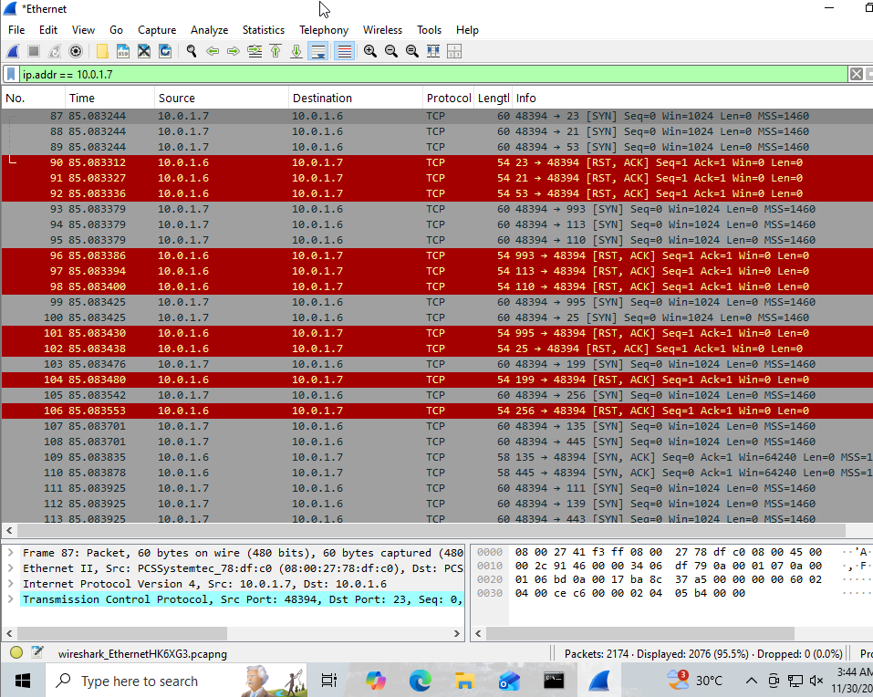

# 🕵️ Network Traffic Analysis: Nmap Port Scan Detection

## 1. Project Scope
**Objective:** To analyze network traffic patterns generated by a reconnaissance scan and identify Indicators of Compromise (IOCs) using packet capture tools.
**Tools Used:**
* **Attacker:** Nmap (Kali Linux)
* **Victim:** Windows 10 Enterprise
* **Analysis:** Wireshark

## 2. Attack Simulation
I simulated an external threat actor performing a "Stealth" SYN Scan to identify open ports on the target workstation.

* **Command:** `nmap -sS -p 1-1000 10.0.1.6`
* **Intent:** The attacker attempts to map the attack surface without completing the TCP handshake, hoping to bypass basic logging.

## 3. Analysis & Findings
Upon analyzing the PCAP (Packet Capture) file in Wireshark, I observed the following anomalies:

### 🚩 The "Syn Storm"
The traffic log shows a massive spike in TCP packets originating from the Attacker IP.
* **Pattern:** Rapid `SYN` packets sent to sequential ports (21, 22, 23, 24...) within milliseconds.
* **Response:** The target machine replies with `RST, ACK` (Reset) for closed ports, or `SYN, ACK` for open ports.
* **Missing Handshake:** There are no final `ACK` packets from the attacker to complete the connection on closed ports. This confirms it is a scan, not legitimate traffic.

## 4. Evidence
Below is the Wireshark capture showing the high volume of SYN packets (Gray) targeting the victim (10.0.1.6).

## 5. Conclusion & Defense
This activity indicates the **Reconnaissance Phase** of the Cyber Kill Chain.
* **Defense Strategy:** To block this, I would implement a firewall rule to **Rate Limit** incoming SYN packets from a single IP.
* **Detection:** A SIEM rule should be created to trigger an alert if `> 20 SYN packets` are received from a unique Host within `1 second`.
