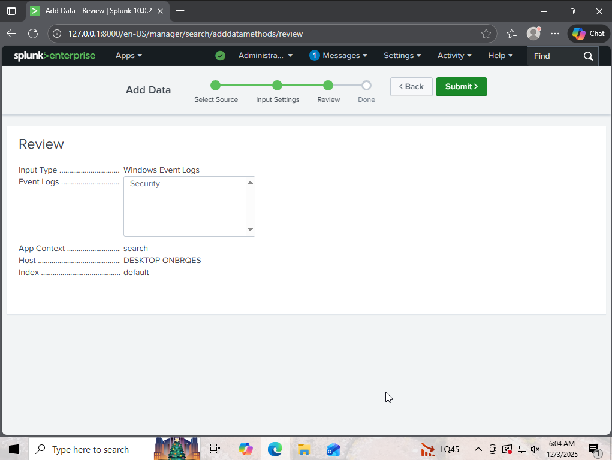
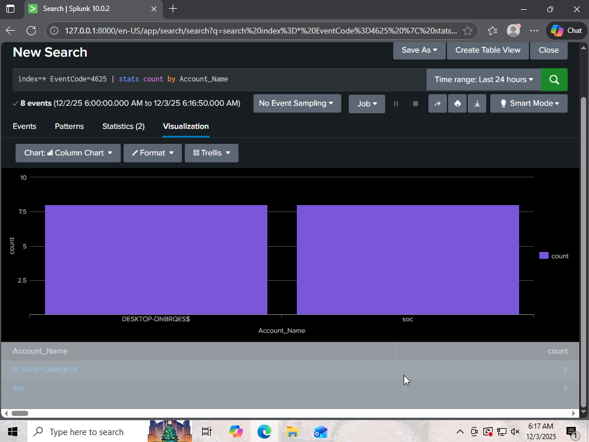

# 🛡️ SIEM Lab: Brute Force Attack Detection

## 1. Project Overview
**Objective:** To detect identity-based attacks using Splunk Enterprise and Windows Event Logs.
**Scenario:** A threat actor attempts to guess user credentials (Brute Force/Dictionary Attack).
**Data Source:** Windows Security Event Log (Event ID 4625).
**Tools Used:** Splunk

## 2. Technical Configuration

* **Ingestion:** Configured Splunk to monitor the local `Security` log channel.
* **Normalization:** Mapped raw Windows Event Logs to Splunk's Common Information Model (CIM) fields.

## 3. Detection Logic (The SPL Workflow)

### Phase 1: Discovery (Raw Logs)
First, I searched for the specific Windows Event Code for "Logon Failure" to validate that Splunk was ingesting the attack data correctly.

```splunk
index=* EventCode=4625
```
Result: This returned raw log entries for every failed attempt. While this confirmed the attack was occurring, the raw data was too noisy to identify specific targets immediately.

### Phase 2: Aggregation & Intelligence
To turn the raw data into actionable intelligence, I refined the query using the `stats` command. This groups the failures by the target user to identify the specific victim.
``` splunk
index=* EventCode=4625 | stats count by Account_Name
```

* **EventCode=4625:** Filters for "An account failed to log on."
* **stats count by Account_Name:** Aggregates the data to show exactly who is being attacked.

## 4. Visual Evidence & Analysis
The dashboard below highlights the targeted user account and the volume of failed attempts.

### 🚩 Analyst Observations (Describing the Attack)
The telemetry reveals a clear Brute Force pattern characterized by:
* **High Velocity:** A spike of 8 failure events.
* **Target Fixation:** All attempts targeted a specific user account, indicating a focused dictionary attack rather than a broad "Password Spray."
* **Source Consistency:** The attacks originated from a single local workstation, suggesting either an insider threat or a compromised host attempting lateral movement.

## 5. Incident Response Guide
If this alert triggered in a production SOC, I would follow this playbook:
* **Context Check:** Did the user recently expire their password?
* **Source Analysis:** Is the request coming from an internal IP (potential lateral movement) or external (Internet)?
* **Containment:** If malicious, lock the Active Directory account and block the Source IP at the perimeter firewall.
