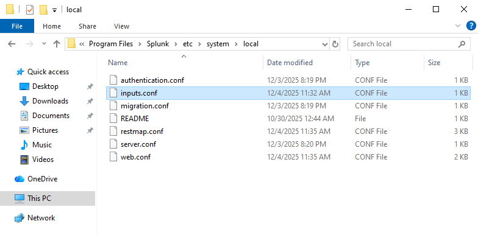
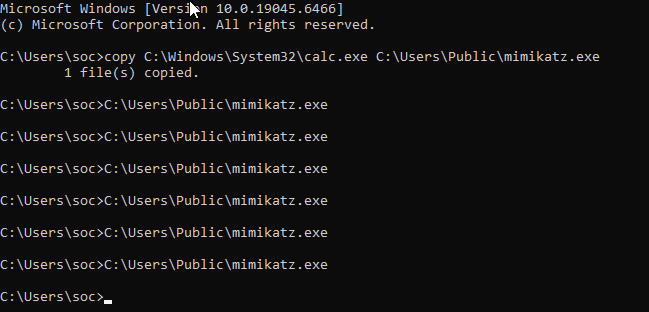
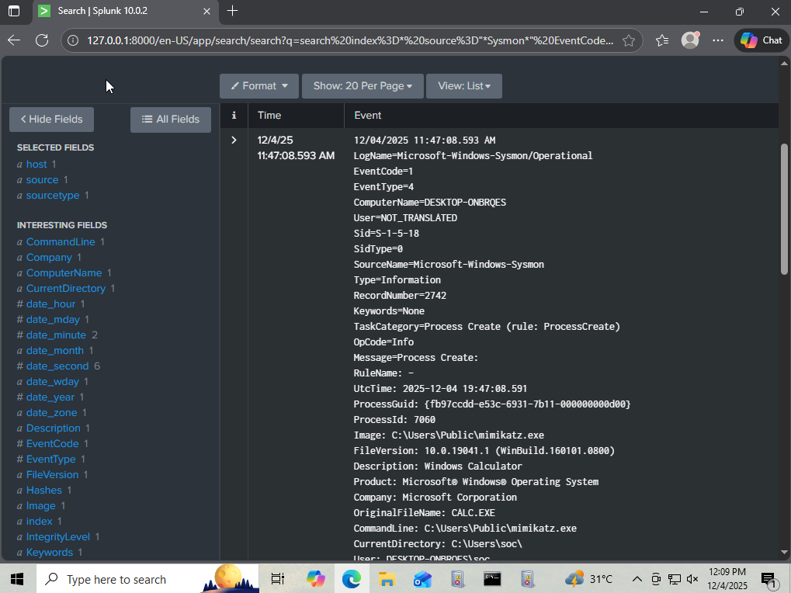

# 🦠 Endpoint Security: Malware Process Detection

<br>

## 1. Project Overview

**Objective:** To detect the execution of known malicious tools using advanced endpoint telemetry (Sysmon).

**Scenario:** A threat actor successfully drops a payload (`mimikatz.exe`) onto a host and executes it to dump credentials.

**Data Source:** Sysmon Event ID 1 (Process Creation).

<br>

## 2. 🛠️ Tools & Technologies

* **SIEM:** Splunk Enterprise (Log Ingestion & Searching).
* **Endpoint Detection:** Sysmon (System Monitor) with SwiftOnSecurity Configuration.
* **Environment:** Windows 10 Enterprise (Virtual Machine).
* **Virtualization:** Oracle VirtualBox.
* **Attack Simulation:** Windows Command Line (`cmd.exe`) & File Utilities.

<br>

## 3. 🔧 Configuration & Troubleshooting

**Challenge Encountered:**
During the setup, Splunk's Web Interface failed to detect the `Microsoft-Windows-Sysmon/Operational` log channel in the "Local Event Logs" menu, even though the service was running in Windows.

**The Fix (Backend Configuration):**
Instead of relying on the GUI, I manually configured the ingestion by editing the Splunk configuration file.

1.  Accessed the config path: `C:\Program Files\Splunk\etc\system\local\inputs.conf`
2.  Added the following stanza to force ingestion:

```ini
[WinEventLog://Microsoft-Windows-Sysmon/Operational]
disabled = 0
renderXml = 1
```
Result: This bypassed the UI bug and successfully piped Sysmon telemetry into the main index.

4. ⚔️ Attack Simulation (Red Team Logic)
To validate the detection rules, I simulated the adversary's behavior using standard Windows utilities to mimic a "Masquerading" attack (MITRE T1036).

**The Execution Flow:**

* **Payload Staging:** I created a copy of the native Windows Calculator (calc.exe) to act as a benign payload.

* **Renaming:** I renamed the artifact to mimikatz.exe to trigger signature-based detection logic.
```ini
copy C:\Windows\System32\calc.exe C:\Users\Public\mimikatz.exe
```

* **Execution:** I manually executed the binary from a non-standard directory (Public) to generate the Process Creation event.

```ini
C:\Users\Public\mimikatz.exe
```

## 5. Threat Hunting Logic
The Hypothesis
Standard Windows logs (Event 4688) often lack the granularity needed to trace parent-child process relationships. I utilized Sysmon Event ID 1 to identify processes running from suspicious locations with known bad filenames.

```ini
index=* source="*Sysmon*" EventCode=1 Image="*mimikatz*"
```
* **Image="mimikatz":** Filters for the specific malicious binary name.

## 6. Visual Evidence
The log entry below captures the exact moment of execution, showing the full file path and the parent process.


## 7. Incident Response Guide
If this specific alert (Mimikatz) triggers in a production environment:
* **Isolate:** Immediately cut network access to the host. Mimikatz is primarily used to steal Admin credentials, which can lead to total domain compromise within minutes.
* **Triage:** Dump the RAM (Memory) for forensics to check if passwords were successfully extracted before the isolation.
* **Reset:** Force a password reset for every user who logged into that machine recently (especially Domain Admins).
